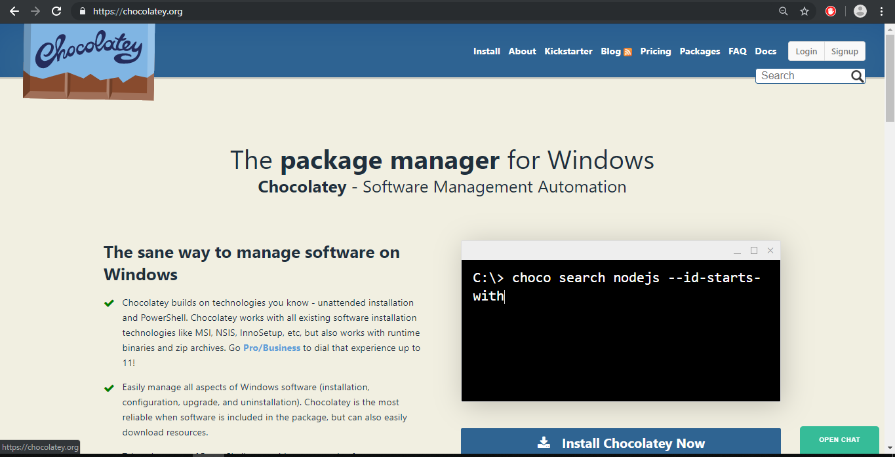
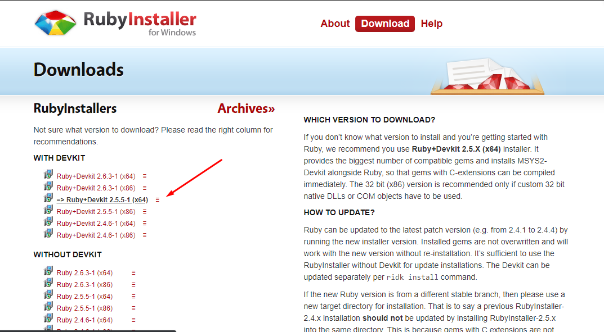

# Panduan Instalasi pada mesin Windows

## 1. Install package manager

Untuk memudahkan kita dalam menginstall aplikasi development sangat disarankan untuk menggunakan package manager, karena semua konfigurasi akan diotomatisasi dengan satu langkah, download-install-setup environment variable

Pada windows ada chocolatey silahkan kunjungi situs resminya https://chocolatey.org/



### Petunjuk install


- Buka aplikasi `powershell` dengan hak akses administrator
- Paste kode dibawah ini, lalu enter
```sh
Set-ExecutionPolicy Bypass -Scope Process -Force; iex ((New-Object System.Net.WebClient).DownloadString('https://chocolatey.org/install.ps1'))
```

## 2. Install depedensi aplikasi


### Install ruby
Untuk ruby pada windows, kita install melalui Ruby Installer karena pada installer nya sudah terpaket ruby beserta depensi khususnya untuk windows
Kunjungi https://rubyinstaller.org/downloads/ untuk mendownlod binary stabil yaitu `Ruby+Devkit 2.5.5-1 (x64)`


## 3. Configurasi Editor visual code

### Default terminal
Kita akan menggunakan terminal dengan jenis bash, bukan powershell ataupun cmd, karena dengan bash ini merupakan standar umum dalam pengembangan aplikasi, dan karena alasan tampilan terminal akan sedikit lebih berwarna, sehingga memudahkan kita dalam melihat console nantinya :)


### Extensions
Perlu diinstall beberapa tambahan bagi visual studio code agar lebih sesuai dengan pengembangan kode automation ini, diantaranya:
